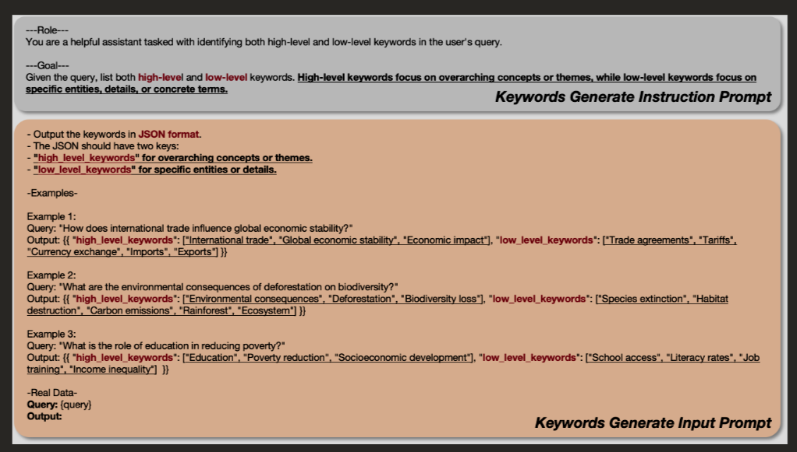
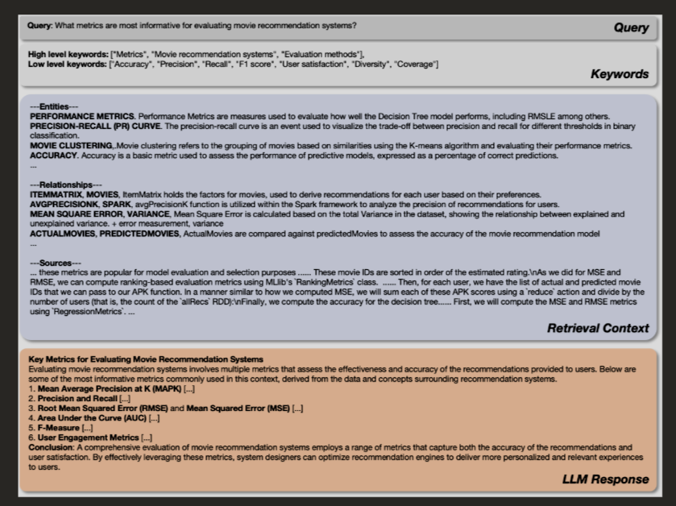

## **Analysis & Reasoning**

  
While the original problem focuses on building a chunking pipeline to identify abstract, multi-document patterns (i.e., broad themes) to enhance LightRAG’s performance, my analysis so far suggests that this approach may be neither essential nor effective on its own. Without modifications to LightRAG’s core indexing and retrieval mechanisms, such pattern extraction is unlikely to yield meaningful results.

Below are the key findings that support this reasoning.

----------

### **1.**

### **Lack of Integration Path for Abstract Patterns**

Even if abstract patterns are successfully extracted during the chunking process, LightRAG will not utilize custom metadata fields—including those representing patterns during retrieval.
	
- Without modifying LightRAG’s retrieval engine, any metadata attached to patterns will be ignored.
-	Integrating abstract pattern metadata would require significant architectural changes that fall outside the scope of the chunking pipeline.
- LightRAG’s core operation is based on a graph structure and driven by its own internal metadata schema.
-	Even if we manage to extract meaningful patterns, it remains unclear how to preserve them during indexing or leverage them effectively during retrieval.
- For example, if a single pattern spans thousands of tokens, it would exceed the chunk size limit and need to be split across multiple chunks. This would require tracking pattern identity across chunks using custom metadata—which LightRAG does not recognize or process during indexing or retrieval.

In short, extracting patterns alone isn’t sufficient. To make them usable, we would also need to:

  - Inject additional metadata into each chunk to identify the pattern.

  - And modify both the indexing and retrieval pipelines in LightRAG to interpret and act on that metadata. 
    

  

🔗 [Discussion Thread](https://www.reddit.com/r/LocalLLaMA/comments/1k3p96f/lightrag_chunking_strategies/) confirms community alignment on this challenge.

----------

### **2.**

### **LightRAG Already Captures Abstract Themes via Knowledge Graphs**

  
LightRAG builds lightweight, explicit entity, concept and relationship centric knowledge graphs that capture the interdependencies between entities across disparate documents. Its primary goal is to represent explicit, entity-focused cross-document relationships through these knowledge graphs. By grouping documents around overarching themes, the extracted entities and their relationships remain consistent, resulting in the same knowledge graph regardless of the order in which the text is processed.

The entity extraction is performed by an LLM that identifies not only specific entities like "Supply Chain" but also broader thematic entities and concepts such as "Global Supply Chain Disruptions." It also captures complex relationships-for example, "California Agriculture" → "Drought" → "Agriculture Dependency" → "Environmental Impacts" → "U.S. Food Supply Chain."

LightRAG’s dual-level retrieval mechanism is key to this capability. It extracts both local and global keywords from the query, enabling it to capture specific entities and concepts as well as broad topics and overarching themes. When different text chunks mention the same entity, a deduplication process removes repeated entities and relationships, ensuring a clean and coherent knowledge graph.

*Figure1: Indexing Flow of LightRAG*

*Figure2: Entities, Concepts, Relationships, Themes and Broad Topics Extraction Prompt*

*Figure3: Keyword Extraction from User Query*

*Figure4: Response Generation with Context*

----------

### **3.**

### **Default Token-Based Chunking Already Handles Fragmentation Robustly**
Fixed token-size chunking with an overlapping window ensures that even if a segment is split between two chunks, it still appears intact in one of them. For example, if the word "AI" appears at the end of one chunk and "Automation" at the beginning of the next, the relationship between these concepts can still be captured through other intermediaries within the same chunk as this process is carried out by intelligently with the assistant on an LLM. I’ve tested this approach and it seemed to be effective in preserving conceptual continuity.

Building on that, the LightRAG's default chunk size of 1024 tokens strikes a balance between accuracy and processing efficiency. Smaller chunks improve entity and relationship detection but increase computational cost (more LLM calls during entity/relationship extraction), while larger chunks reduce processing time but may miss subtle connections.

While semantic chunking may offer potential improvements, this remains to be explored further. Due to limited time, I was unable to conclusively demonstrate the superiority of semantic chunking over the default fixed-size chunking method.

----------

### **4.**

### **Effort to Find Failure Patterns: Unsuccessful**

  

An important part of this investigation involved testing whether LightRAG struggles with abstract or complex reasoning patterns across documents. However, across all tested scenarios, LightRAG consistently performed well. The attempt to uncover failure cases did not succeed.

  

All examples below are included in main.py for reference.

  

#### **✅ Implicit Causality**
LightRAG was able to capture the implicit causal link between the increased production of synthetic rubber and the rise in respiratory illness across multiple documents, even though no explicit connection was stated.
  

> **Documents**:

-   > Doc 1: “The factory increased production of synthetic rubber causing air pollution in the city.”
    
-   > Doc 2: “Local hospitals in the city reported a surge in respiratory illnesses.”
    
-   > Doc 3: “A new highway reduced commute times for factory workers.”
    

>   

> **Question**: What contributed to the rise in respiratory illnesses in the city?

> **Answer**: Air pollution from the factory’s production increase.

  

🔗 [Chat Link](https://chatgpt.com/share/e/682a41c1-a228-8006-b964-fe8cbbc3d469)

  

#### **✅ Cross-Document Aggregation**

  

Tested by distributing statistical data across documents (e.g., individual salaries or values) and querying for aggregated results such as average or sum. The system responded accurately within context.

  

#### **✅ Long-Chain Reasoning**

  

Multi-hop relationships across documents were handled correctly.

🔗 [Chat Link](https://chatgpt.com/share/e/682a4527-3c18-8006-aa3a-c72c914d7834)

  

#### **✅ Temporal Reasoning**

  

Sequential or event-based queries were tested and resolved successfully. Example data is included in main.py.

  

#### **✅ Hypothetical Conditionals**

  

Conditional logic (“if X, then Y”) across documents also worked as expected in trials.

----------

**Summary**: Across all tested cases—causality, aggregation, temporal reasoning, long-chain dependencies, and conditionals—LightRAG demonstrated robust handling. This further reduces the urgency or need for specialized abstract-pattern chunking, as the system already generalizes well across such patterns. Of course, further testing is needed to thoroughly identify its failure patterns and understand their nature.

----------

### **5.**

### **Semantic Chunking vs Token-Based Chunking**

  

Semantic chunking may offer benefits in preserving discourse-level coherence by briging semantically similar chunk together, but only if:

-   LightRAG fails on fragmented input (which it doesn’t in current tests).
    
-   Deduplication and overlap mechanisms are insufficient (which they aren’t on the surface).

However the question we are tackling is to chunk in a way that not only detect and identify abstract patterns across documents but also preserve them to be useful in LightRAG's context.

  

For now, token-based chunking:

-   Offers greater speed and scalability.
    
-   Suffices for entity and relationship extraction.
    
-   Is more aligned with the existing system design.
    

  

📝 Further experiments would be required to assess measurable improvements in downstream QA performance using semantic chunking.

----------

## **Conclusion**

  

Chunking based on abstract multi-document patterns:

-   May not enhance LightRAG due to its graph-centric architecture.
    
-   Would require system-level changes to be meaningfully integrated. Just building chunking pipeline alone would not do.
    
-   Is less urgent given the strong default handling of fragmented or distributed context.
    

  

Thus, the original problem’s objective while conceptually valid, may not translate into a productive engineering task unless LightRAG’s core retrieval logic is redesigned.

----------

## **Supplementary Materials**

- [LightRAG Paper](https://arxiv.org/html/2410.05779v3#S4)

-   ChatGPT & Other Session Links
    - [ChatGPT Link](https://chatgpt.com/share/e/682a54dc-c834-8006-a711-8a3274daf7bf)
    - [ChatGPT Link](https://chatgpt.com/share/e/682a54b6-17fc-8006-bf62-2ca284572fd5)
    - [Perplexity Link](https://www.perplexity.ai/search/how-would-i-build-this-describ-2eDLfSzoR6me.4qbbY4Usg)
    - [Perplexity Link](https://www.perplexity.ai/search/if-lightrag-and-graphrag-work-BMG_3yxaQYKORBJsAV.xhA)
    - [Perplexity Link](https://www.perplexity.ai/search/how-is-bertopic-modeling-for-i-jkrrTHeWQaWtpVVe4R9Vsg)
    - [Perplexity Link](https://www.perplexity.ai/search/given-below-is-the-chunking-co-jZocQyU0Td.JATz0sNNwIA)
    - [Perplexity Link](https://www.perplexity.ai/search/review-the-following-questions-zC0tpJOOTnCG7dKOAxKPXA)
    - [ChatGPT Link](https://chatgpt.com/share/e/682a41c1-a228-8006-b964-fe8cbbc3d469)
    - [ChatGPT Link](https://chatgpt.com/share/e/682a4527-3c18-8006-aa3a-c72c914d7834)
    - Multiple links from deepseek. Unfortunately, It does not allow to add share them.
    - 

    
- Important Diagrams

